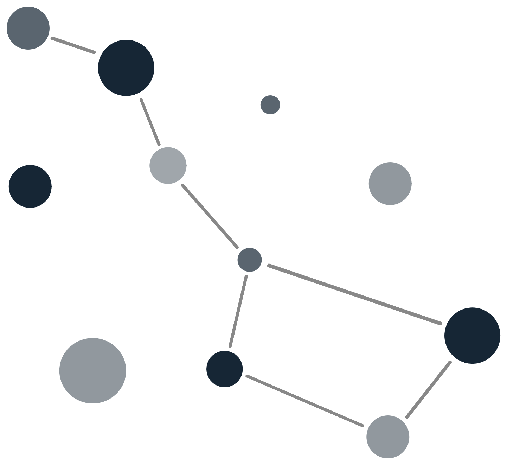

#  NebulaNet

NebulaNet is a Python library that generates abstract SVG backgrounds inspired by star constellations. Perfect for wallpapers, websites, or any creative project needing beautiful procedural backgrounds.

## Installation

Clone the repository and install the package in editable mode:

```bash
git clone https://github.com/olivbw/NebulaNet.git
cd nebulanet
pip install -e .
```

## Command Line Usage

### Available predifined styles

- `olivier_website`
- `dark_space`
- `sunset_dream`


### Generate a background using a predefined style

```bash
nebulanet --style olivier_website --output background.svg
```

### Generate a background using a custom JSON style file

```bash
nebulanet --style path/to/custom_style.json --output custom_background.svg
```

## Python Usage

```python
from nebulanet.generator import NebulaNet
from nebulanet.styles import PREDEFINED_STYLES
from nebulanet.config_loader import load_style_from_json

# Use a predefined style
style = PREDEFINED_STYLES['dark_space']

# Or load a custom style from JSON
# style = load_style_from_json('path/to/custom_style.json')

nn = NebulaNet(1920, 1080, style)
nn.generate('my_background.svg')
```

## Creating Your Own Style JSON

You can create your own style JSON file with the following structure:

```json
{
  "background_color": "#000000",
  "line_color": "#ffffff",
  "point_color": "#00ffcc",
  "min_point_size": 2,
  "max_point_size": 6,
  "line_threshold": 100
}
```
Use this file with the CLI or Python API as shown above.

## Requirements

- Python 3.7+
- `svgwrite` (installed automatically via pip)

## Contributing

Feel free to fork, open issues, or submit pull requests!

## License

This project is licensed under the MIT License.


